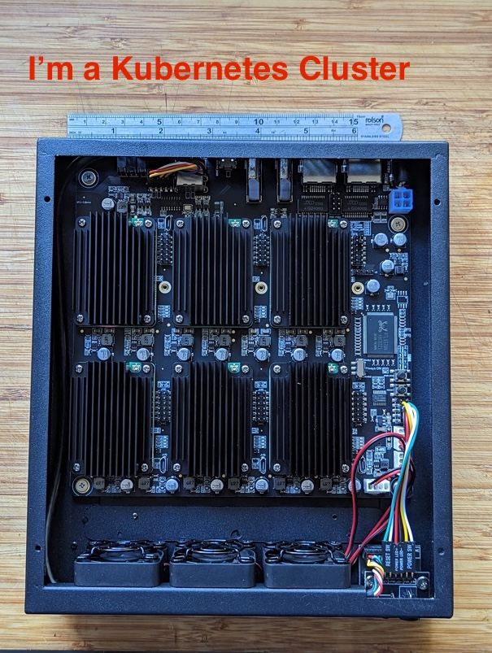

# Prepare Raspberry PI cluster for installing K3S

Forked from [this repo](https://github.com/k3s-io/k3s-ansible).

Modified to perform the following:

1. removed support for armhf and CentOS
2. download additional binaries used. e.g. k9s, helm

```shell
# install the cluster
ansible-playbook install.yml -i inventory/super6c

# tear down the cluster
ansible-playbook reset.yml -i inventory/super6c

```

## Hardware

This repository has been tested with my current K3S cluster , which  consists of 6 [Raspberry Pi Compute Module 4](https://www.raspberrypi.com/products/compute-module-4/?variant=raspberry-pi-cm4001000) with 8GB RAM installed on a [Deskpi Super6C board](https://deskpi.com/collections/deskpi-super6c/products/deskpi-super6c-raspberry-pi-cm4-cluster-mini-itx-board-6-rpi-cm4-supported) with [matching case](https://deskpi.com/collections/deskpi-super6c/products/deskpi-itx-case-kit-for-deskpi-super6c-raspberry-pi-cm4-cluster-mini-itx-board). Each board has a 256G NVMe SSD attached.



| IP address | hostname | role |
|---|---|---|
| 192.168.1.204 | pie4 | master, longhorn storage node, servicelb node |
| 192.168.1.205 | pie5 | worker node, longhorn storage node |
| 192.168.1.206 | pie6 | worker node, longhorn storage node |
| 192.168.1.207 | pie7 | worker node, longhorn storage node |
| 192.168.1.208 | pie8 | worker node, longhorn storage node |
| 192.168.1.209 | pie9 | worker node, longhorn storage node |

## Software

Each CM4 module runs [Rapsian OS](https://www.raspbian.org/) based on Debian 11.

Currently I run [lightweight Kubernetes K3S](https://k3s.io) with [Longhorn](https://longhorn.io) as storage driver. [Flux CD](https://fluxcd.io) is used to manage the infrasturecture and applicatino software running in the cluster. See this repo [k3s-fluxcd-vinolab](https://github.com/sloppycoder/k3s-fluxcd-vinolab) for details.
